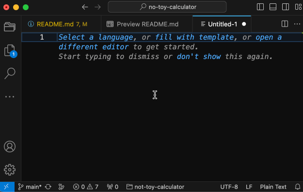
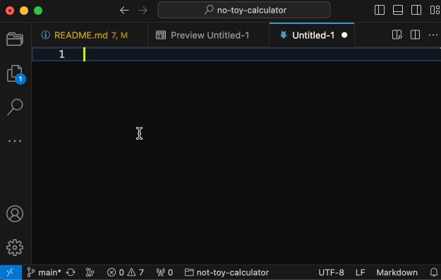
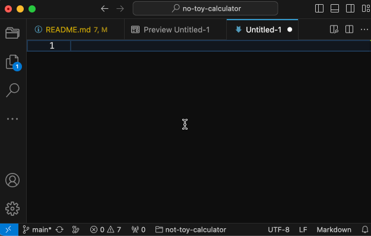
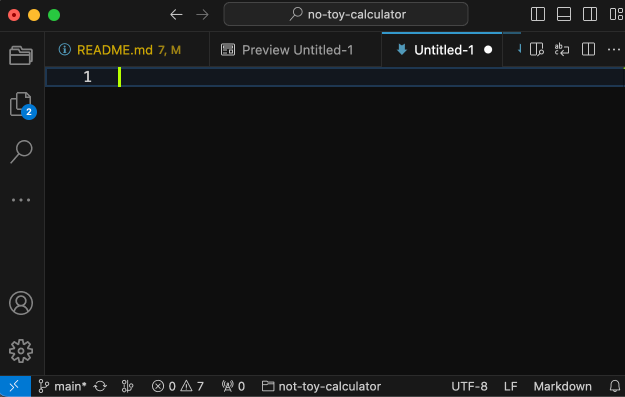
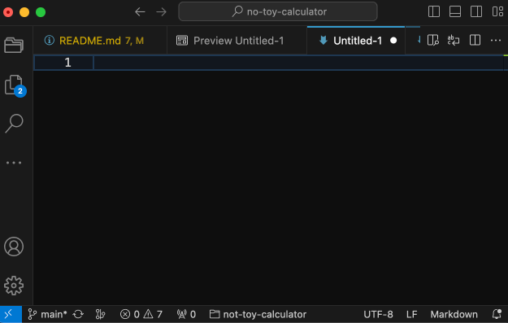

[//]: # (To record a screen cast do the following)
[//]: # (1. Resize vscode to 640x400)
[//]: # (2. In VSCode enable "Developer: Toggle Screencast Mode")
[//]: # (3. Record with LICEcap)

# Toy Calculator
No-Toy Calculator (NTC) is a calculator available in any VSCode editor
window. Place the cursor to the right of an expression and invoke
`no-toy-calculator.eval` (No-Toy Calculator Evaluate) to calculate the
result.

NTC supports the following:

## Basic arithmetic
Supports basic arithmetic operations:
1. `/` and `*` - division and multiplication.
2. `+` and `-` - addition and substraction.
3. `%` - modulo.
4. `**` - raise to power.

## Fuzzy input
You can continue evaluating over and over again after `→`. You can also
evaluate an expression in the middle of any text. NTC will do its best
to figure out where is the beginning of the expression.

## Multiple cursors and selection support

## Hexadecimal, octal and binary numbers support
Numbers that start with `0x`, `0o` and `0b` are interpreted as
hexadecimal, octal and binary. Use `hex`, `oct` and `bin` decorators to
show the result as hexadecimal, octal and binary numbers. Decorators can
appear anywhere in the expression.

## Arbitrary precision support
Use `pre <FACTOR>` decorator to change precision. The default precision
is 20, meaning that results will be limited to 20 digits in the
mantissa.

## Variables support
`$?` contains the result of the last evaluation. Assign variable with
`$NAME = ...`. All variables are local to the buffer.

